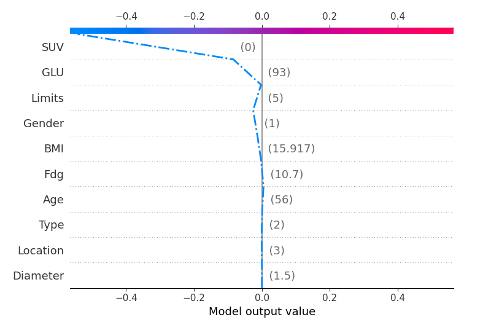
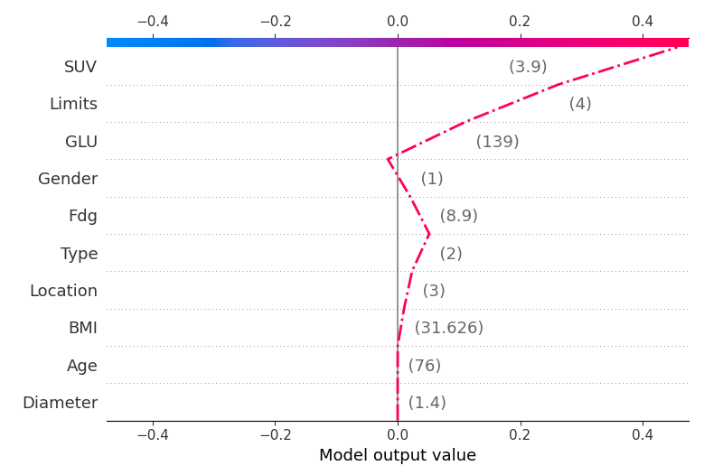

# EMERALD - ML - NSCLC
[](https://github.com/emeraldUTH/EMERALD-NSCLC-ML/)
[](README.md)
[](https://opensource.org/licenses/MIT)

This is the official <b>ML</b> implementation for NSCLC ML classification work showcased on 
["Explainable Classification for Non-Small Cell Lung Cancer Based on Positron Emission Tomography Features and Clinical Data"](https://ieeexplore.ieee.org/abstract/document/10345893).


## Paper Abstract
Non-small cell lung cancer (NSCLC) is the most common form of lung cancer. It is a complex disease, that is typically diagnosed in 
advanced stages, mainly using image data from PET/SPECT scans. The main focus of the present work is to develop a computer-aided 
classification model relying exclusively on clinical data, that can identify benign/malignant Solitary Pulmonary Nodules (SPN) related 
to NSCLC. For this purpose, a dataset was created using biometric and clinical data from 243 patients (54% malignant cases, 70% male, 67 
average age) along with the doctor's yield. Four different well-documented Machine Learning (ML) classification algorithms were employed 
to provide prediction models for this scenario. A stratified ten-fold validation approach and common metrics were utilized to assess each 
model's performance. Furthermore, the best performing model's prediction process was analyzed in order to provide explainability for the 
prediction results. The significance of this study is twofold: first, it demonstrates the efficacy of ML-assisted prediction to 
characterize SPNs. Second, it provides an added layer of explainability to a black-box machine learning (ML) prediction model. Ergo, this 
approach can enhance trust and confidence in the model's results and enable users to better understand the decision-making process. The 
AdaBoost algorithm provided the most accurate prediction model with an accuracy of 94.33 % and True Positive Rate (TPR) of 95.71 %. Therefore, 
this work demonstrates the potential for an ML approach to improve the diagnosis of NSCLC, while also providing explainable classification.

## Usage

The **SPN Classification Framework** is designed to provide a lightweight, highly accurate methodology for classifying Solitary Pulmonary Nodules (SPN) using 
a minimal feature set, focused primarily on clinical data. This framework avoids the typical reliance on large image datasets such as PET/CT scans, making it 
more portable and efficient for broader applications.

### Key Features
- **No Image Data Required**: Unlike most studies that rely heavily on PET, SPECT, or CT scans, this framework utilizes a small set of clinical features, offering a simplified and portable solution for **SPN malignancy prediction**.
- **Explainability**: The framework enhances the interpretability of machine learning (ML) models, providing insights into the decision-making process by explaining the model's predictions through SHAP or other explainability techniques.
- **Robust Evaluation**: The performance of the models is validated through **stratified 10-fold cross-validation**, ensuring reliable and generalizable results even with a small dataset.
- **Multi-Algorithm Approach**: The framework supports the evaluation of four well-documented ML algorithms, ensuring a thorough exploration of the best model for **lung cancer classification**.

### Example Interpretations
Below are two examples of feature importance, illustrating how the framework explains the model's prediction process by highlighting key clinical features:

Benign case:



Malignant case:



The framework also provides **model-level interpretations**, helping users understand the overall feature impact on the dataset as a whole. These interpretations are essential for ensuring transparency in **SPN malignancy classification**.

### Contributions
1. **SPN malignancy prediction without image data**: This framework provides an effective way to classify SPNs using only clinical data, avoiding the complexity and size requirements of image-based datasets.
2. **Comprehensive model evaluation**: It assesses the performance of four widely used ML algorithms through five different metrics and stratified 10-fold cross-validation, ensuring robust and reliable results.
3. **Black-box model explainability**: By using advanced explainability techniques, the framework demystifies the internal mechanics of ML models, enabling better understanding and trust in the predictions.

The **SPN Classification Framework** is ideal for situations where quick, accurate, and portable lung cancer classification is needed, without the overhead of image-based datasets, all while maintaining high levels of transparency and explainability.

An example of usage for EMERALD-NSCLC-ML is shown below:

```python
from catboost import CatBoostClassifier

# Initialize the model
catb = CatBoostClassifier(n_estimators=79, learning_rate=0.1, verbose=False)
```

The `catb` defines the initilization for the specific ML model used (in this case **CatBoost**). In our implementation
`n_estimators` defines the number of estimators employed by the algorithm and `learning_rate` the logarithmic learning rate.

### Training

An example of the training process is provided in the `nsclc.py` script. The `nsclc.py` script can be used to train an
ML model given a set of training dataset. The `nsclc.py` script can be used as follows:

```python
data_path = 'nsclc_loc.csv'
data = pd.read_csv(data_path, na_filter = False)
dataframe = pd.DataFrame(data.values, columns=data.columns)
x = dataframe.drop(['Output'], axis=1)
y = dataframe['Output']

sel_alg = catb
X = x

est = sel_alg.fit(X, y)
n_yhat = cross_val_predict(sel_alg, X, y, cv=10)

print("cv-10 accuracy: ", cross_val_score(sel_alg, X, y, scoring='accuracy', cv = 10).mean() * 100)
print("cv-10 accuracy STD: ", cross_val_score(sel_alg, X, y, scoring='accuracy', cv = 10).std() * 100)
scoring = {
    'sensitivity': metrics.make_scorer(metrics.recall_score),
    'specificity': metrics.make_scorer(metrics.recall_score,pos_label=0)
}
print("sensitivity: ", cross_val_score(sel_alg, X, y, scoring=scoring['sensitivity'], cv = 10).mean() * 100)
print("sensitivity STD: ", cross_val_score(sel_alg, X, y, scoring=scoring['sensitivity'], cv = 10).std() * 100)
print("specificity: ", cross_val_score(sel_alg, X, y, scoring=scoring['specificity'], cv = 10).mean() * 100)
print("specificity STD: ", cross_val_score(sel_alg, X, y, scoring=scoring['specificity'], cv = 10).std() * 100)
```

It is recomended to save the trained model and subset using either the `dump` function. For example:

```python
joblib.dump(est, f'{sel_alg}_model.joblib')
```

### Interpretations

An example of the training process is provided in the `ml_xai.py` script. The `ml_xai.py` script can be used to explain
the model stored by the `nsclc.py` script. The `ml_xai.py` script can be used as follows:

```python
est = sel_alg.fit(X, y)
n_yhat = cross_val_predict(est, X, y, cv=10)
print("Testing Accuracy: {a:5.2f}%".format(a = 100*metrics.accuracy_score(y, n_yhat)))

print("###### SHAP ######")
# print('Number of features %d' % len(est.feature_names_in_))
effect_sizes = cohen_effect_size(X, y)
effect_sizes.reindex(effect_sizes.abs().sort_values(ascending=False).nlargest(40).index)[::-1].plot.barh(figsize=(6, 10))
plt.title('Features with the largest effect sizes')
plt.show()

xai_cat(est, X)
```

## Citation
If you find this work useful, please cite our paper:

```
@inproceedings{Samaras2023explainable,
  title = {Explainable Classification for Non-Small Cell Lung Cancer Based on Positron Emission Tomography Features and Clinical Data},
  author = {Samaras, Agorastos-Dimitrios and Apostolopoulos, Ioannis D. and Moustakidis, Serafeim and Papageorgiou, Elpiniki and Papathanasiou, Nikolaos D. and Apostolopoulos, Dimitrios J. and Papandrianos, Nikolaos},
  booktitle = {2023 14th International Conference on Information, Intelligence, Systems \& Applications (IISA)},
  pages = {1--8},
  year = {2023},
  doi = {10.1109/IISA59645.2023.10345893},
  url = {https://doi.org/10.1109/IISA59645.2023.10345893}
}
```
